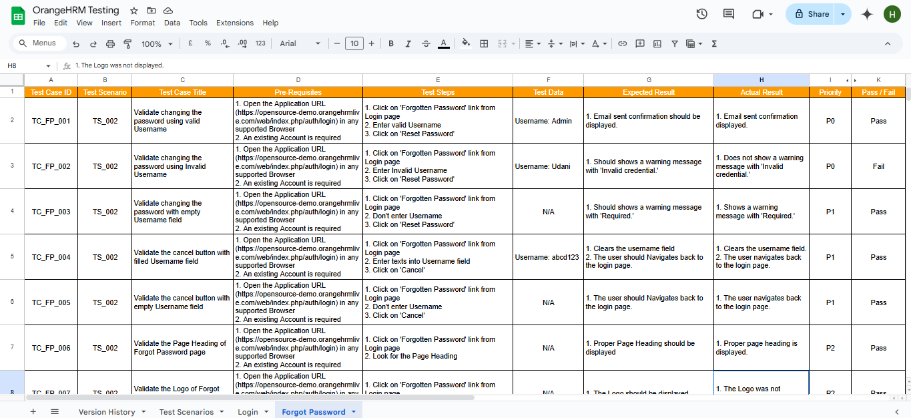

# [OrangeHRM-Testing](https://opensource-demo.orangehrmlive.com/web/index.php/auth/login)

>_The website you provided is a demo version of OrangeHRM, an open-source Human Resource Management (HRM) software. It offers a range of HR functionalities, such as employee management, leave tracking, time and attendance management, and performance evaluation. The demo version allows users to explore the platform's interface and features, offering a glimpse into how the software can be used to streamline HR processes within an organization. It is designed to help HR professionals manage their workflows effectively._

    

#### Intro

This project focuses on QA automation testing for the OrangeHRM platform using Java and Selenium. The goal is to ensure the seamless functionality of key HR features such as employee management, leave tracking, time and attendance management, and performance evaluation. Automated tests help identify issues quickly, ensuring a smooth and efficient experience for HR professionals and users.

####  Test Cases

For the full list of login scenario test cases, check out [this spreadsheet](https://docs.google.com/spreadsheets/d/1T51dV4lZTaBOTyECM2Dw3TMwA1JJbCaFQkZKMfrtNrU/edit?usp=sharing).

#### Technologies Used
* Java
* Selenium WebDriver
* TestNG (for test execution)
* Maven (for build automation)

#### Key Features

* Automated testing of OrangeHRM functionalities
* Tests for employee management, leave tracking, time and attendance management, performance evaluation, and more.
